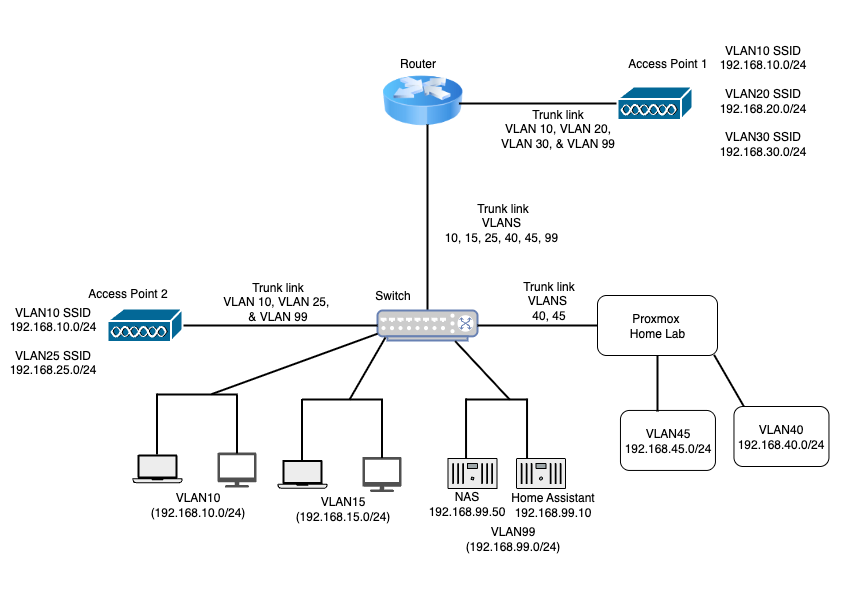
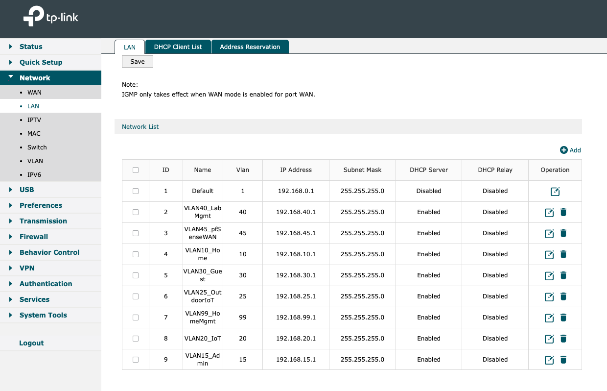
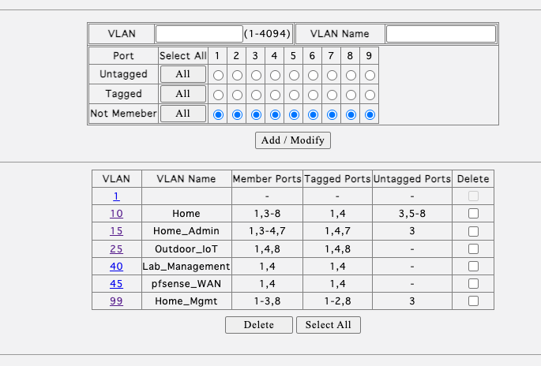
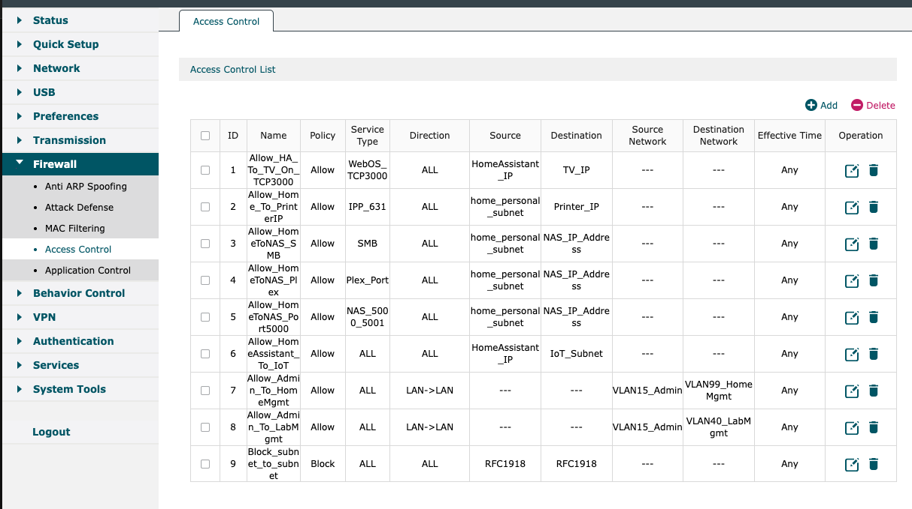
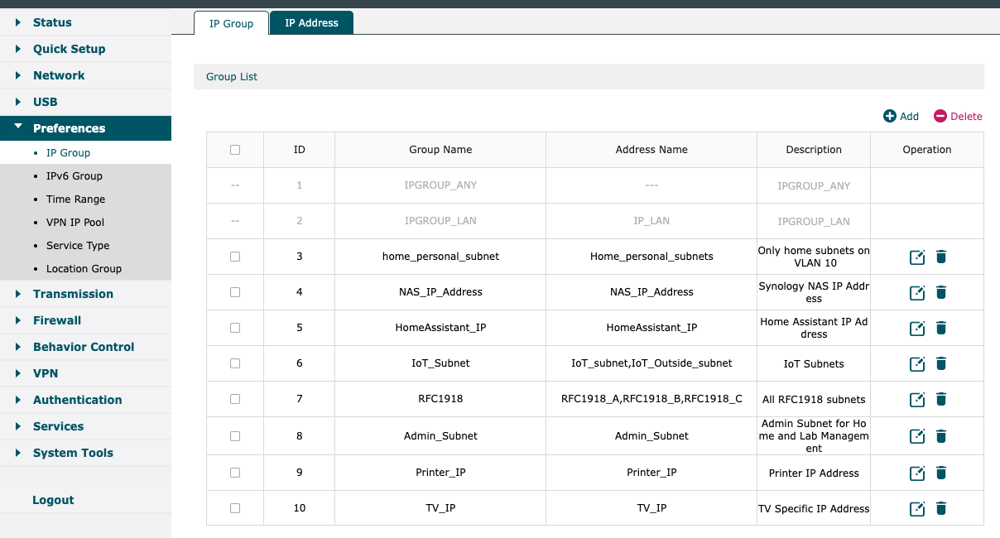
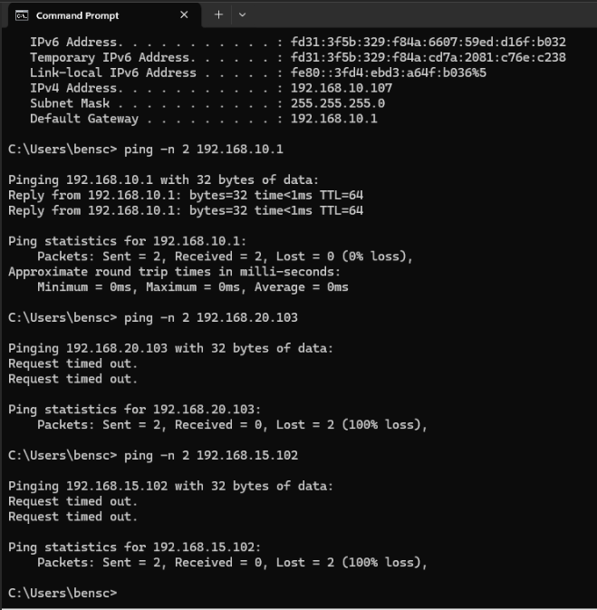
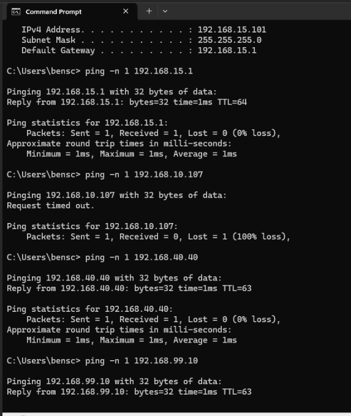
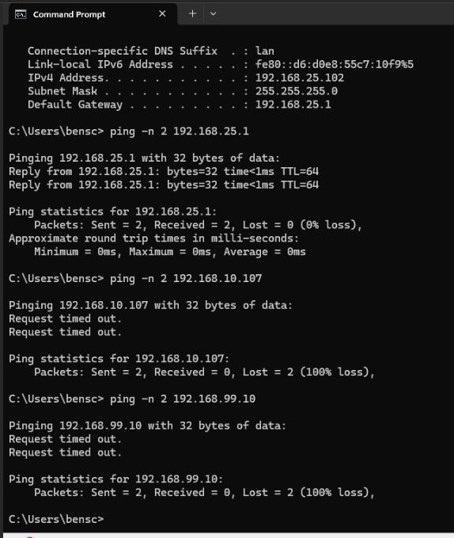

# Zero Trust Home Network & Homelab: VLAN Segmentation & ACL Enforcement

*A production home network secured with enterprise-grade Zero Trust principles, documented as a homelab project for learning and portfolio sharing.*

## 1. Objective
The objective was to design and implement a secure, segmented home network architecture to protect critical resources, limit lateral movement, and simulate enterprise-grade security controls in a residential environment.

**Figure 1: Network Diagram**

## 2. Environment Overview
* Router: TP-Link ER605 (supports VLANs, ACLs, inter-VLAN routing)  
* Generic Managed Switch With 802.1Q support  
* Access Points: EAP620HD and EAP 110 VLAN capable APs  
* Storage: Synology NAS  
* Endpoints: PCs, smartphones, IoT devices, smart TVs, etc.  

## 3. Network Design
### VLAN Layout

**Figure 2: Router VLAN Table**

| VLAN ID | VLAN Name       | Purpose / Devices                                        | Gateway IP     | Notes                                                       |
|---------|----------------|----------------------------------------------------------|----------------|-------------------------------------------------------------|
| 10      | Home/Personal  | Laptops, phones, TVs, printers (non-admin devices)        | 192.168.10.1   | General home devices, no direct access to management VLANs  |
| 15      | VLAN15_Admin   | Admin PCs for managing infrastructure & lab              | 192.168.15.1   | Can access VLAN 40 & 99; blocked from others unless allowed |
| 20      | IoT            | Indoor IoT devices (smart plugs, bulbs, wifi devices)    | 192.168.20.1   | No inter-VLAN access except Home Assistant exceptions       |
| 25      | Outdoor_IoT    | Outdoor Smart Devices                                    | 192.168.25.1   | Same restrictions as VLAN 20                                |
| 30      | Guest          | Guest phones, laptops                                    | 192.168.30.1   | Internet only, isolated from other VLANs                    |
| 40      | Lab_Management | Lab management (Proxmox, etc)                            | 192.168.40.1   | Highly restricted; only VLAN15_Admin can reach              |
| 45      | pfSense_WAN    | pfSense WAN uplink to ER605                              | 192.168.45.1   | No inbound rules; purely transit to ISP/router              |
| 99      | Home_Management| NAS, switches, APs, router, Home Assistant               | 192.168.99.1   | Highly restricted; only VLAN15_Admin can reach              |

**Figure 3: Switch VLAN Port Mapping**  

---

## 4. Security Controls & ACL Mapping

**Figure 4: Firewall Access Control Rules**  

**Figure 6: IP Address Groups**  

1. **Segmentation**  
   * Policy: Each device group is placed in its own VLAN.  
   * Implementation: No device exists in multiple VLANs.  

2. **Default-Deny Policy**  
   * Policy: Block all inter-VLAN traffic unless explicitly allowed.  
   * Implementation in ACL:  
     * Rule 9 – Block_subnet_to_subnet: Deny RFC1918 → RFC1918 ensures no VLAN can talk to another unless a specific allow rule exists.  

3. **Management VLAN Isolation**  
   * Policy: Networking infrastructure in VLAN99, accessible only from Admin VLAN15.  
   * Implementation in ACL:  
     * Rule 7 – Allow_Admin_To_HomeMgmt: Permits VLAN15_Admin to access VLAN99_HomeMgmt for network management tasks.  

4. **Service-Specific Access**  
   * Policy: Allow only essential services/ports instead of full VLAN-to-VLAN access.  
   * Implementation in ACL:  
     * Rule 3 – Allow_HomeToNAS_SMB: TCP/445 only (file sharing).  
     * Rule 4 – Allow_HomeToNAS_Plex: TCP/32400 only (Plex streaming).  
     * Rule 5 – Allow_HomeToNAS_Port5000: TCP/5000–5001 only (NAS web UI).  
     * Rule 2 – Allow_Home_To_PrinterIP: TCP/631 only (IPP printing).  
     * Rule 1 – Allow_HA_To_TV_On_TCP3000: TCP/3000 only (LG webOS control).  

5. **IoT Quarantine**  
   * Policy: IoT devices (indoor/outdoor) are isolated; only Home Assistant access is allowed.  
   * Implementation in ACL:  
     * Rule 6 – Allow_HomeAssistant_To_IoT: Grants Home Assistant access to IoT VLANs for automation while keeping other VLANs blocked.  

6. **IP-Specific Rules**  
   * Policy: Limit access to specific hosts instead of whole VLANs to reduce attack surface.  
   * Implementation in ACL:  
     * Rule 6 – Allow_HomeAssistant_To_IoT: Uses a specific HomeAssistant_IP (not entire VLAN99).  
     * Rules 3–5 & 2: Only the NAS IP and Printer IP are reachable from Home VLAN on their required ports.  
     * Rule 1 – Allow_HA_To_TV_On_TCP3000: Only the TV’s IP is reachable from Home Assistant on TCP/3000.  

---

## 5. Testing & Validation
Test Objective:  
To confirm that VLAN segmentation and ACL policies are correctly applied by verifying IP assignments, gateway reachability, and blocked/allowed inter-VLAN communication.  

### VLAN10 Host Isolation  
* Host IP: 192.168.10.107 (VLAN10 – Home/Personal)  
* Ping Targets:  
    * 192.168.10.1 (VLAN10 Gateway) → Ping successful (baseline connectivity within VLAN).  
    * 192.168.20.103 (VLAN20 – IoT) → Ping failed as expected (blocked by ACL).  
    * 192.168.15.102 (VLAN15 – Admin) → Ping failed as expected (inter-VLAN traffic denied).  
✅ Validation: Confirms that devices in VLAN10 can reach their gateway but are isolated from IoT and Admin VLANs.  

  
**Figure 6: VLAN10 Host Isolation with Ping Results**  

### VLAN15 Admin Access  
* Host IP: 192.168.15.101 (VLAN15 – Admin)  
* Ping Targets:  
    * 192.168.15.1 (VLAN15 Gateway) → Ping successful (baseline connectivity within VLAN).  
    * 192.168.10.107 (VLAN10 – Home/Personal) → Ping failed as expected (blocked by ACL).  
    * 192.168.40.40 (VLAN40 – Lab Management) → Ping successful (allowed by ACL).  
    * 192.168.99.10 (VLAN99 – Home Management) → Ping successful (allowed by ACL).  
✅ Validation: Demonstrates that Admin VLAN hosts can reach their gateway and are selectively granted access to VLAN40 and VLAN99, while remaining restricted from VLAN10.  

  
**Figure 7: VLAN15 Admin Access with Ping Results**  

### VLAN25 Outdoor IoT Isolation  
* Host IP: 192.168.25.102 (VLAN25 – Outdoor IoT)  
* Ping Targets:  
    * 192.168.25.1 (VLAN25 Gateway) → Ping successful (baseline connectivity within VLAN).  
    * 192.168.10.107 (VLAN10 – Home/Personal) → Ping failed as expected (blocked by ACL).  
    * 192.168.99.10 (VLAN99 – Home Management) → Ping failed as expected (IoT devices restricted from management plane).  
✅ Validation: Confirms Outdoor IoT VLAN devices can reach their gateway but remain fully quarantined from Home/Personal and Management VLANs.  

  
**Figure 8: VLAN25 Outdoor IoT Isolation with Ping Results**  

---

## 6. Lessons Learned
One of the most valuable experiences from this project was troubleshooting during the migration of access points to VLAN99 (Home Management VLAN).  
* The SSIDs were originally mapped to VLANs 10, 15, 20, and 30, but the AP’s own management interface needed to be reachable on VLAN99.  
* This created a scenario where the management VLAN was not directly accessible from the admin subnet, requiring careful adjustment of ACLs.  

Through research and testing, I identified two solutions:  
1. Temporarily reassigning my management workstation to VLAN99 for direct access.  
2. Creating a controlled ACL that allowed the Admin VLAN (15) to reach VLAN99 while keeping other VLANs restricted.  

This reinforced my understanding of VLAN tagging, switch port configuration, and management-plane isolation in a multi-VLAN environment.  

Another key lesson came after enforcing ACLs for VLAN isolation. My Home Assistant automation that triggers when the TV powers on stopped working.  
* The root cause was that inter-VLAN traffic was fully blocked, which unintentionally cut off the legitimate control flow from Home Assistant to the TV in VLAN10.  
* The fix was refining firewall rules to allow only the specific traffic needed (Home Assistant → TV IP) while keeping unnecessary access blocked.  

---

## 7. Key Takeaways
* Applied the least privilege principle by granting devices only the exact access required, reducing the attack surface.  
* Designed and enforced network segmentation through dedicated VLANs for each device category, ensuring strict isolation.  
* Implemented role-based access control so that administrative capabilities were tied to VLAN roles, not physical network position.  
* Adopted a zero trust approach, blocking all inter-VLAN traffic by default and allowing only explicitly defined flows.  
